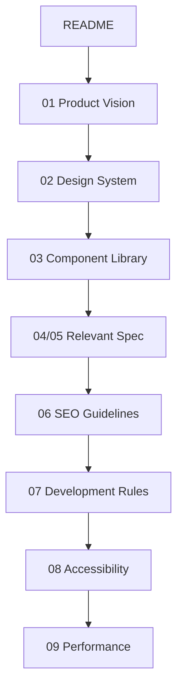
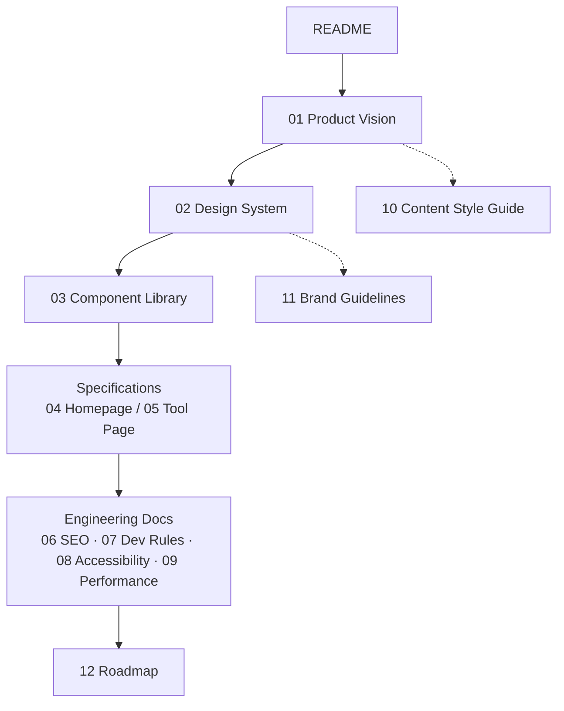

# ImageFlow Engineering Handbook

> **Version:** 1.2 &nbsp;·&nbsp; **Last Updated:** 2026-07-24 &nbsp;·&nbsp; **Status:** Living Document &nbsp;·&nbsp; **Owner:** Founding Engineering

---

## 1. Welcome

This is the ImageFlow Engineering Handbook — the single source of truth for how ImageFlow is designed, built, documented, and maintained.

Every engineer, designer, contributor, and AI coding assistant working on ImageFlow is expected to read this document **before** making any code, design, SEO, or documentation change. It defines how the handbook is organized, how to navigate it, and the standards every future document must follow.

This README does not describe ImageFlow's features or roadmap in detail — it describes how the *documentation itself* works.

---

## 2. About ImageFlow

ImageFlow is a browser-based productivity platform for PDF, image, and AI-assisted file tools, built to be fast, private, and accessible without requiring installs or accounts for core functionality.

It exists to give people professional-grade file tools in the browser, without the friction, cost, or data-handling concerns of traditional desktop software.

The long-term vision is to grow ImageFlow into a broader file productivity and management platform, extending beyond PDFs and images into a full suite of everyday file utilities.

Full product philosophy, positioning, and long-term strategy are documented in **`01-Product-Vision.md`** — this README intentionally stays high-level.

---

## 3. Product Principles

Product Principles describe what ImageFlow optimizes for. They are distinct from **Engineering Principles** (§17), which describe *how* we build — these describe *what we're building toward*.

- **Zero friction by default** — core tools work without sign-up, install, or payment.
- **Privacy as default, not upsell** — files are handled conservatively regardless of tier.
- **Speed is a feature** — a slow tool is a broken tool, even if it's functionally correct.
- **One tool, one job** — each tool page solves a single problem completely rather than many problems partially.
- **Free core, sustainable edges** — monetization extends the product; it never gates the core promise.
- **Earn trust before asking for it** — deeper account features are offered after value is demonstrated, not before.

Product Principles inform *what* gets prioritized on the Roadmap (`12-Roadmap.md`); Engineering Principles inform *how* it gets implemented once prioritized.

---

## 4. Documentation Philosophy

Documentation is treated as a first-class engineering artifact, not an afterthought. ImageFlow's documentation exists so that:

- Any contributor — human or AI — can understand *why* something is built the way it is, not just *what* it does.
- Design, architecture, and content decisions are traceable and don't have to be re-litigated in every discussion.
- Knowledge doesn't live only in one person's head or one closed pull request.

**Core rule:** documentation evolves together with the codebase. A change that isn't documented is considered incomplete, regardless of whether the code works.

---

## 5. Documentation Metadata Standard

Every document in `docs/` carries a standard metadata header so its purpose, status, ownership, and freshness are visible without reading the full file.

```yaml
---
title: Tool Page Spec
purpose: Defines structure and behavior shared by all individual tool pages
owner: Design + Frontend
status: Stable          # Draft | Stable | Deprecated | Living
version: 1.2
created: 2026-01-10
last_updated: 2026-07-24
review_cycle: Quarterly
depends_on: [02-Design-System, 03-Component-Library]
referenced_by: [06-SEO-Guidelines, 10-Content-Style-Guide]
---
```

| Field | Meaning |
|---|---|
| `title` | The document's name, matching its filename |
| `purpose` | One sentence — what problem this document exists to solve |
| `owner` | The **role or team** accountable for accuracy — never a named individual, so the document doesn't go stale when a person leaves |
| `status` | `Draft` (not yet authoritative), `Stable` (authoritative), `Deprecated` (superseded, kept for history), `Living` (intentionally never "finished," e.g. Roadmap) |
| `version` | See §6 — bumped on meaningful content changes, not typo fixes |
| `created` | The date this document first entered the handbook |
| `last_updated` | The date of the most recent substantive edit |
| `review_cycle` | How often this document should be re-validated even if nothing prompted a change (e.g., Quarterly, Annually, Living — never) |
| `depends_on` | Documents this one assumes are true and current |
| `referenced_by` | The inverse of `depends_on` — which documents point back to this one |

`depends_on` and `referenced_by` must always agree with each other across the handbook. If Document A lists Document B under `depends_on`, Document B must list Document A under `referenced_by`. This two-way link is what keeps §20 (Documentation Relationships) accurate as the handbook grows, and is what will eventually let this graph be validated by tooling rather than memory.

The status table in §8 is the aggregated view of this metadata across all documents — it should always match what's declared in each file's own header.

---

## 6. Versioning Strategy

The handbook has a version (top of this file) and each document has its own independent version.

- **Handbook version** bumps on structural changes — new documents added, documents renumbered, or sections like this one introduced.
- **Document version** bumps on meaningful content changes to that file (`MAJOR.MINOR`): **MAJOR** for changes that invalidate prior guidance (e.g., a spec reversal), **MINOR** for additive clarifications.
- Typo fixes, formatting, and link corrections do not bump version numbers.
- Deprecated documents are never deleted outright — they're marked `status: Deprecated` and linked to their replacement, so historical decisions remain traceable.

---

## 7. Documentation Update Process

Whenever a document changes — whether triggered by a code change, a design decision, or a scheduled `review_cycle` — the same process applies, without exception:

1. **Update the document's `version` field**, per the rules in §6.
2. **Update `last_updated`** to the date of the change.
3. **Verify `depends_on`** — confirm the documents this one relies on still say what it assumes they say.
4. **Update any document listed in `referenced_by`** if this change affects what they claim.
5. **Check for contradictions** against the Decision Hierarchy (§18) and the dependency graph in §20 — a change that creates a conflict must resolve it before merging, not after.
6. **Commit documentation changes in the same pull request as the implementation change** — never as a separate follow-up commit or a "docs TODO."

Documentation and code are required to evolve together because the moment they're allowed to update on different timelines, they silently diverge — and a handbook nobody trusts is worse than no handbook at all. Step 6 is what makes this enforceable: it is checked as part of the Definition of Done (§14), not left to good intentions.

---

## 8. Engineering Handbook Structure

```
docs/
├── README.md                    ← You are here
├── 01-Product-Vision.md
├── 02-Design-System.md
├── 03-Component-Library.md
├── 04-Homepage-Spec.md
├── 05-Tool-Page-Spec.md
├── 06-SEO-Guidelines.md
├── 07-Development-Rules.md
├── 08-Accessibility.md
├── 09-Performance.md
├── 10-Content-Style-Guide.md
├── 11-Brand-Guidelines.md
└── 12-Roadmap.md

prompts/
└── ...                           ← Reusable AI prompt templates (see §10)
```

| # | Document | Purpose | Status |
|---|----------|---------|--------|
| 01 | Product Vision | Why ImageFlow exists, who it serves, long-term strategy | Stable |
| 02 | Design System | Visual language: color, type, spacing, elevation, motion | Stable |
| 03 | Component Library | Canonical UI components — what exists, when to reuse vs. create new | Stable |
| 04 | Homepage Spec | Structure, content, and behavior of the marketing homepage | Stable |
| 05 | Tool Page Spec | Structure and behavior shared by all individual tool pages | Stable |
| 06 | SEO Guidelines | Metadata, schema, content, and technical SEO standards | Stable |
| 07 | Development Rules | Architecture conventions, coding standards, review expectations | Stable |
| 08 | Accessibility | WCAG compliance rules and accessible-by-default patterns | Stable |
| 09 | Performance | Performance budgets, loading strategy, Core Web Vitals targets | Stable |
| 10 | Content Style Guide | Voice, tone, terminology, and writing conventions | Draft |
| 11 | Brand Guidelines | Logo usage, brand voice, visual identity rules | Draft |
| 12 | Roadmap | Planned features and prioritization | Living |

`prompts/` stores versioned, reusable prompt templates used to brief AI coding assistants consistently across tasks — so two different assistants (or the same assistant on two different days) approach the same class of problem the same way.

---

## 9. Required Reading Order

The document numbering above **is** the intended reading order — each document assumes you've internalized the ones before it.



1. **README** — how the handbook works
2. **Product Vision** — why we're building this
3. **Design System** — the visual language everything is built from
4. **Component Library** — what UI building blocks already exist
5. **Relevant Specification** (Homepage or Tool Page) — what you're actually building
6. **SEO Guidelines** — how it must be discoverable
7. **Development Rules** — how it must be engineered
8. **Accessibility** — who it must work for
9. **Performance** — how fast it must be

Content Style Guide, Brand Guidelines, and Roadmap are referenced as needed rather than read strictly in sequence — see §20 (Documentation Relationships).

---

## 10. AI Contributor Workflow

ImageFlow is actively developed with AI coding assistants (Claude, Cursor, Antigravity, Windsurf, GitHub Copilot, and others). AI contributors follow the same standards as human contributors — no exceptions.

**Required sequence before writing any code:**

1. Understand Product Vision (`01`)
2. Understand Design System (`02`) and Component Library (`03`)
3. Read the relevant Specification (`04`/`05`)
4. Understand Development Rules (`07`)
5. Only then implement

**Hard constraints for AI contributors:**

- Never skip documentation to move faster.
- Never invent new design patterns when an existing one in the Component Library covers the case.
- Never duplicate a component that already exists — extend or compose instead.
- Never ignore accessibility requirements to save implementation time.
- Never ignore SEO requirements when touching public-facing pages.
- Never modify unrelated code, files, or formatting outside the scope of the task.

> **Note:** If a task appears to require deviating from these rules, that's a signal to raise the conflict, not to resolve it silently — see §12 (AI Conflict Resolution Policy).

---

## 11. AI Behavior Rules

Where §10 governs *sequence* (what to read, in what order), this section governs *conduct* — how an AI contributor should behave when facing ambiguity, gaps, or conflicting instructions.

- **Do not fabricate documentation.** If a spec doesn't cover a case, say so — don't invent a plausible-sounding rule and present it as existing convention.
- **Surface ambiguity; don't silently resolve it.** If a task's instructions conflict with a documented spec, flag the conflict rather than picking a side unilaterally.
- **Treat existing code as intentional.** Unless documented otherwise, assume current implementation choices were deliberate — propose changes, don't quietly "fix" patterns you find unfamiliar.
- **Disclose scope creep.** If solving a task well requires touching something outside its stated scope, say so before doing it, not after.
- **Disclose new dependencies.** Adding a package or external service is a decision, not an implementation detail — it should be visible in the change, not buried in a diff.
- **Prefer the smallest correct change.** Comprehensive rewrites are rarely the right response to a scoped task.

For the specific case where two handbook documents actively contradict each other, see §12 — that scenario has a stricter, mandatory procedure rather than judgment calls.

---

## 12. AI Conflict Resolution Policy

This section is distinct from §18 (Decision Hierarchy). The Decision Hierarchy resolves **intentional trade-offs** between competing priorities (e.g., speed vs. accessibility). This policy governs **contradictions** — cases where two documents, or a document and an explicit instruction, cannot both be true. A contradiction is a defect in the handbook, not a trade-off to weigh.

If an AI contributor — Claude, Cursor, Antigravity, Windsurf, GitHub Copilot, or any future assistant — detects a contradiction, it must, without exception:

1. **Stop implementation immediately.** Do not proceed on an assumed interpretation, even if one reading seems more likely correct.
2. **Identify the conflict precisely** — name the specific documents and sections that disagree.
3. **Explain the contradiction in plain language** — what each source claims, and why they can't both hold.
4. **Request clarification from a human reviewer before continuing.**

Guessing is never an acceptable substitute for asking. A wrong guess implemented and merged is more expensive than a paused task.

---

## 13. Human Contributor Workflow


1. **Feature** is scoped and understood
2. **Specification** is written or referenced before code
3. **Implementation** follows Design System, Component Library, and Development Rules
4. **Testing** covers functionality, accessibility, and performance
5. **Documentation** is updated to reflect the change
6. **Review** checks both code and documentation
7. **Merge** only happens once both are complete

---

## 14. Definition of Done

A feature is **not** complete when it works. It is complete when every applicable item below is true — this is distinct from the pre-PR Maintenance Checklist (§24), which is a submission gate; this is the completion contract.

- [ ] Implementation matches the relevant Specification (§8, docs `04`/`05`)
- [ ] Uses existing Component Library patterns, or the Component Library has been updated to include new ones
- [ ] Passes accessibility requirements (`08-Accessibility.md`)
- [ ] Meets performance budgets (`09-Performance.md`)
- [ ] SEO requirements met, if the change touches a public-facing page
- [ ] Automated tests written and passing
- [ ] Documentation updated to reflect the change, following the process in §7
- [ ] Reviewed and approved by at least one other contributor
- [ ] Verified in a staging/preview environment, not just locally

If any box can't be checked, the feature isn't done — it's in progress, regardless of how much of it is merged.

---

## 15. Documentation Rules

| Rule | Applies When |
|------|--------------|
| Every feature requires documentation | Any new user-facing or internal capability |
| Every UI change updates the Design System | New tokens, patterns, or visual conventions |
| Every component change updates the Component Library | New, modified, or deprecated components |
| Every SEO change updates SEO Guidelines | Metadata, schema, routing, or content structure changes |
| Every architecture change updates Development Rules | New conventions, patterns, or structural decisions |
| Every roadmap change updates the Roadmap | Scope, priority, or timeline shifts |

**Non-negotiable:** documentation is never left outdated. A pull request that changes behavior without updating the relevant document is incomplete, regardless of code quality.

---

## 16. Change Management

Not all changes carry the same weight. ImageFlow distinguishes between routine changes and structural ones so review effort scales with actual risk.

| Change Type | Examples | Process |
|---|---|---|
| **Routine** | Bug fixes, content edits, new tool built on existing patterns | Standard PR + review (§13) |
| **Additive** | New component, new spec section, new document | Standard PR, but must update Documentation Relationships (§20) |
| **Structural** | New architectural pattern, breaking API change, deprecating a document or component | Short written proposal (problem, options considered, recommendation) shared before implementation begins |

Structural changes are not blocked by process for its own sake — the proposal can be a few paragraphs. The goal is that no one discovers a breaking or precedent-setting change for the first time in a pull request review.

---

## 17. Engineering Principles

- **Accessibility First** — usable by everyone, by default, not retrofitted
- **SEO First** — discoverability is a design constraint, not an afterthought
- **Performance First** — speed is treated as a feature
- **Reusable Components** — compose before creating
- **Scalable Architecture** — decisions hold up as the product grows
- **Security** — user files and data are handled conservatively by default
- **Maintainability** — code should be understandable by someone who didn't write it
- **Consistency** — patterns behave the same way everywhere they appear
- **Developer Experience** — the codebase should be pleasant to work in
- **User Experience** — every technical decision is ultimately in service of this

---

## 18. Decision Hierarchy

Principles occasionally conflict — a deadline pressures against accessibility, a design preference pressures against performance. When they do, precedence is resolved in this order, highest first:

1. **Security & Privacy** — never compromised for speed or convenience
2. **Accessibility** — never traded away for visual preference or deadline pressure
3. **Product Vision alignment** (`01-Product-Vision.md`) — does this serve what ImageFlow is actually for
4. **Performance** — within the above constraints, the faster solution wins
5. **Design System consistency** — deviate only with a documented reason
6. **Individual convenience or preference** — lowest precedence; yields to everything above

This hierarchy resolves trade-offs between priorities that are all individually valid. It does **not** apply when documents actually contradict each other — that case is a defect, handled by §12 (AI Conflict Resolution Policy) instead. If a genuine trade-off can't be resolved by this ordering — e.g., two items at the same level conflict — it's escalated as a Structural change (§16) rather than decided silently in a PR.

---

## 19. Design Token Philosophy

Design tokens (color, spacing, type scale, elevation, motion values) are the single source of truth for visual decisions — components and pages consume tokens, they never hardcode values that a token already represents.

- A visual change should be possible by editing a token, not hunting through components.
- Tokens are named semantically where possible (e.g., `color-surface-danger`, not `color-red-3`), so intent survives a future palette change.
- Component-level overrides of token values are treated as a Structural change (§16), not a quiet local fix.

Full token naming, tiering (primitive vs. semantic), and theming rules live in `02-Design-System.md` — this section exists so the philosophy is visible before you ever open that file.

---

## 20. Documentation Relationships

Documents relate to each other as a dependency graph, not a single linear chain — some are read once and referenced constantly, others apply only in specific workflows.



| Document | Depends On | Informs |
|----------|-----------|---------|
| Product Vision | — | Everything below |
| Design System | Product Vision | Component Library, Brand Guidelines |
| Component Library | Design System | Homepage Spec, Tool Page Spec |
| Homepage Spec | Component Library | SEO Guidelines, Content Style Guide |
| Tool Page Spec | Component Library | SEO Guidelines, Content Style Guide |
| SEO Guidelines | Homepage/Tool Page Spec | Development Rules |
| Development Rules | Product Vision, Component Library | Accessibility, Performance |
| Accessibility | Component Library | Development Rules |
| Performance | Development Rules | Development Rules (feedback loop) |
| Content Style Guide | Product Vision | Homepage/Tool Page Spec content |
| Brand Guidelines | Design System | Content Style Guide, marketing surfaces |
| Roadmap | Product Vision | All future specs |

**Adding a new document:**

1. Determine which existing documents it genuinely depends on — not just what's thematically related.
2. Add itself to `referenced_by` in each of those documents' metadata (§5), keeping the link two-way.
3. Add a row to the dependency table above.
4. Update the diagram above only if the new document introduces a new tier or a cross-cutting relationship — not for every addition.

If you're updating one document, check this table for what else may now be out of date.

---

## 21. Folder Structure

```
app/
components/
lib/
hooks/
styles/
public/
docs/
assets/
design/
prompts/
```

This structure is intentionally generic and framework-agnostic at the top level. Framework-specific conventions (e.g., routing structure) are documented in `07-Development-Rules.md`, not here.

---

## 22. Naming Conventions

Lightweight, top-level conventions — full detail lives in `07-Development-Rules.md`.

| Item | Convention | Example |
|---|---|---|
| Documentation files | `NN-Title-Case-With-Hyphens.md` | `05-Tool-Page-Spec.md` |
| React components | `PascalCase` | `ToolPageHeader.tsx` |
| Hooks | `useCamelCase` | `useFileUpload.ts` |
| Utility functions | `camelCase` | `formatFileSize()` |
| Design tokens | `kebab-case`, semantic | `color-surface-danger` |
| Branches | `type/short-description` | `feat/pdf-merge-tool` |

Consistency here matters more than any individual choice — don't introduce a new convention without updating this table.

---

## 23. Rules for Future Contributors

- Think before coding.
- Reuse before creating.
- Document before merging.
- Performance matters — always.
- Accessibility matters — always.
- SEO matters — always.
- Keep interfaces consistent with existing patterns.
- Respect existing architecture; don't route around it silently.

---

## 24. Maintenance Checklist

Review before opening any pull request:

- [ ] Documentation updated to reflect the change
- [ ] Accessibility checked (keyboard nav, contrast, screen reader labels)
- [ ] SEO checked (metadata, schema, headings) if a public page changed
- [ ] Performance checked (bundle size, load time, layout shift)
- [ ] Responsive behavior tested across breakpoints
- [ ] Existing components reused rather than duplicated
- [ ] No unrelated code or formatting changes included

---

## 25. Long-Term Vision

This handbook will grow as ImageFlow grows. Documents likely to be added in future phases include:

- Testing Guidelines
- API Documentation
- Infrastructure & Deployment
- Analytics
- Internationalization
- Design Tokens
- User Research
- Security
- Contribution Guide

New documents should follow the same numbering, structure, and cross-referencing conventions established here.

---

## 26. Project Glossary

| Term | Meaning |
|---|---|
| **Handbook** | This entire `docs/` folder, treated as one coherent, cross-referenced system |
| **Spec** | A specification document (e.g., Tool Page Spec) describing structure and behavior for a class of page |
| **Component Library** | The canonical set of reusable UI components — the "don't build this again" list |
| **Design Token** | A named, reusable visual value (color, spacing, type) that components consume instead of hardcoded values |
| **Living Document** | A document with no fixed end-state — expected to change indefinitely (e.g., Roadmap) |
| **Trade-off** | A conflict between two individually valid priorities, resolved by precedence (§18) |
| **Contradiction** | Two documents claiming things that cannot both be true — a defect, handled by §12, not weighed by §18 |
| **Structural Change** | A change significant enough to require a short proposal before implementation (§16) |
| **Definition of Done** | The completion contract for a feature — distinct from the pre-PR Maintenance Checklist (§24) |
| **Depends On / Referenced By** | The two-way link between documents that keeps the dependency graph (§20) accurate |
| **Tool Page** | An individual, single-purpose utility page (e.g., "Merge PDF") |

---

## 27. Closing Statement

This handbook exists to ensure ImageFlow remains consistent, scalable, maintainable, and user-focused as it grows — regardless of who or what is contributing to it. Every document that follows builds on the structure defined here; none should contradict it.
